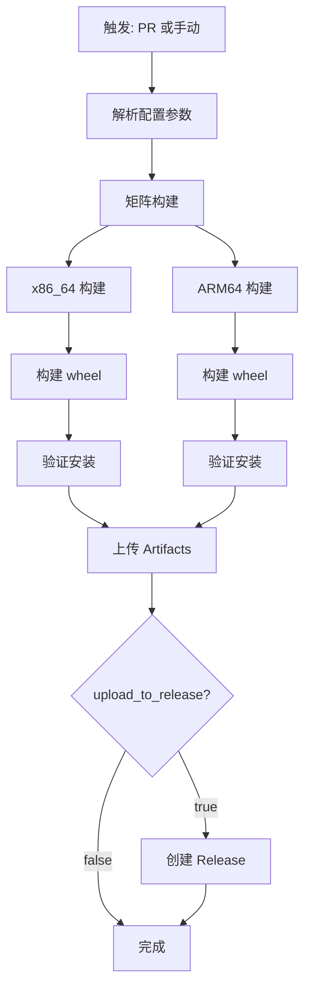

# UCM Wheel Builder

自动化构建 [unified-cache-management](https://github.com/ModelEngine-Group/unified-cache-management.git) 的 Python wheel 包。

## 功能特性

- ✅ **PR 触发构建** - 通过 Pull Request 触发自动构建
- ✅ **手动触发构建** - 通过 workflow_dispatch 手动指定参数
- ✅ **多架构支持** - 同时构建 x86_64 和 ARM64 (aarch64)
- ✅ **多 Python 版本** - 支持 Python 3.11/3.12/3.13
- ✅ **原生 ARM64 构建** - 使用 GitHub ARM64 Runner（无需 QEMU 模拟）
- ✅ **自动验证** - 构建后自动测试 wheel 安装
- ✅ **Release 归档** - 自动创建 GitHub Release 并上传 wheel

## 使用方法

### 方法一：PR 触发（推荐）

1. 创建 Pull Request

2. 在 PR body 中添加配置块：

```yaml
build_config:
  ucm_ref: v0.5.0        # UCM 分支、tag 或 commit SHA
  python_version: 3.11   # Python 版本
  upload_to_release: true # 是否上传到 Release
```

3. workflow 自动解析配置并构建

### 方法二：手动触发

1. 进入 Actions 页面

2. 选择 "Build UCM Wheels" workflow

3. 点击 "Run workflow"

4. 填写参数：
   - `ucm_ref`: UCM 分支/tag (如 `main`, `v0.5.0`)
   - `python_version`: Python 版本
   - `upload_to_release`: 是否上传到 Release

## 构建产物

### Artifacts（30天保留）

每次构建会生成以下 artifacts：
- `wheel-x86_64-py<version>` - x86_64 wheel 包
- `wheel-aarch64-py<version>` - ARM64 wheel 包

### GitHub Releases（永久保存）

如果启用 `upload_to_release`，wheel 包会被上传到 GitHub Release：
- Release tag: `ucm-{ucm_ref}-py{python_version}-{timestamp}`
- 包含构建信息和安装说明

## 示例

### 构建 UCM v0.5.0 + Python 3.11

```
PR body:
---
build_config:
  ucm_ref: v0.5.0
  python_version: 3.11
  upload_to_release: true
---
```

结果：
- Release: `ucm-v0.5.0-py3.11-20250423-123456`
- 包含 `uc_manager-*-cp311-*-linux_x86_64.whl` 和 `uc_manager-*-cp311-*-linux_aarch64.whl`

### 构建 UCM main 分支 + Python 3.12

```
手动触发:
  ucm_ref: main
  python_version: 3.12
  upload_to_release: false
```

结果：
- 仅保存到 Artifacts（30天）
- 不创建 Release

## Workflow 流程



## 架构支持

| 架构 | Runner | 方式 | 速度 |
|------|--------|------|------|
| x86_64 | `ubuntu-latest` | 原生编译 | 快 (~3分钟) |
| aarch64 | `ubuntu-24.04-arm` | 原生编译 | 快 (~5分钟) |

**注意**：使用 GitHub ARM64 Runner 进行原生编译，无需 QEMU 模拟，稳定性高。

## 配置选项

| 参数 | 说明 | 默认值 | 可选值 |
|------|------|--------|--------|
| `ucm_ref` | UCM 分支/tag/commit | `main` | 任意有效引用 |
| `python_version` | Python 版本 | `3.11` | `3.11`, `3.12`, `3.13` |
| `upload_to_release` | 上传到 Release | `true` | `true`, `false` |

## 常见问题

### Q: PR 触发但配置未解析？

检查 PR body 中的 YAML 配置块格式是否正确：
```yaml
build_config:
  ucm_ref: main
  python_version: 3.11
```

### Q: ARM64 构建失败？

GitHub ARM64 Runner (`ubuntu-24.04-arm`) 需要在仓库设置中启用：
1. 进入 Settings → Actions → General
2. 在 "Runner groups" 中添加 ARM64 runner

### Q: 如何下载构建的 wheel？

1. **从 Artifacts**：进入 workflow run → Artifacts → 下载对应架构的 zip
2. **从 Release**：进入 Releases → 选择对应 tag → 下载 .whl 文件

## 相关链接

- [UCM 仓库](https://github.com/ModelEngine-Group/unified-cache-management)
- [跨平台编译指南](../.claude/skills/cross-compile-wheel.md)